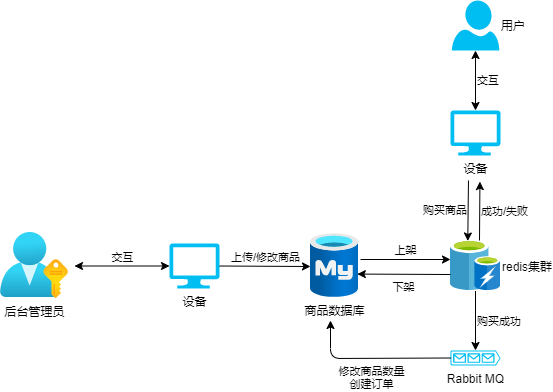

# 一、登录与csrf防御
## 1. 登录流程

用户名为 unique 键，密码经过 bcrypt 算法加密后存储在数据库中。用户登录时根据用户名在数据库中找到密码进行验证，如果验证失败返回相应错误信息给客户端，如果验证成功在内存中创建 session ，然后把 sessionID 放在响应头中作为 Set-Cookie 的值返回给客户端，客户端就会之后每次都带着 sessionID 进行访问。

## 2.csrf防御

Spring Security默认实现 csrf 防御，不过是基于 model 的，本项目为前后端分离的项目，需要设置成基于 cookie 的。即对于每一个 POST 请求，不论成功与否，都向前端通过 Set-Cookie: XSRF-TOKEN=XXXX 向前端返回一个 XSRF-TOKEN ，对于后续的访问，如果是 POST 请求，前端就把这个 XSRF-TOKEN 放进请求头里。而后端对于所有的 POST 请求，后端会去 POST 报文和报文头找 XSRF-TOKEN ，找得到并且匹配得上才允许访问，否则 500 状态码拒绝访问。
 
# 二、商品购买流程

# 三、Todo List
